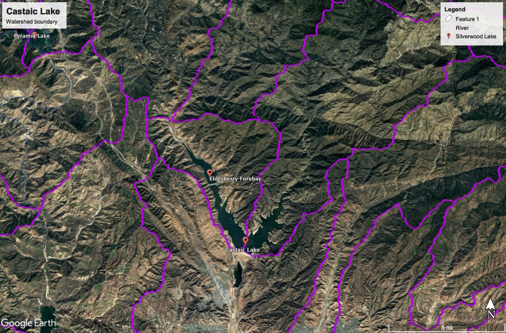

# Castaic Lake/Elderberry Forebay

## Data Sources

Reservoir storage data was collected from the circled station. No stations had discharge data outside 1976-1993.

Temperature and precipitation data was collected from the following NOAA station.

## Data Files

| Filename                                                 | Type                             | Source/Site no.                                                                                        | Start Date | End Date   |
| -------------------------------------------------------- | -------------------------------- | ------------------------------------------------------------------------------------------------------ | ---------- | ---------- |
| [usgs_11108092.csv](usgs_11108092.csv)                   | Reservoir Storage (af) - Daily   | [USGS 11108092](https://waterdata.usgs.gov/nwis/dv?referred_module=sw&site_no=11108092)                | 1995-10-01 | 2017-09-30 |
| [noaa_USC00048014.csv](noaa_USC00048014.csv)             | Temperature/Precipitation        | [NOAA USC00048014](https://www.ncdc.noaa.gov/cdo-web/datasets/GHCND/stations/GHCND:USC00048014/detail) | 1918-07-01 | 2018-07-22 |
| [cdec_CAS_monthly_74_18.csv](cdec_CAS_monthly_74_18.csv) | Reservoir Storage (af) - Monthly | [CDEC CAS](http://cdec.water.ca.gov/dynamicapp/staMeta?station_id=CAS)                                 | 1974-10-01 | 2018-07-01 |