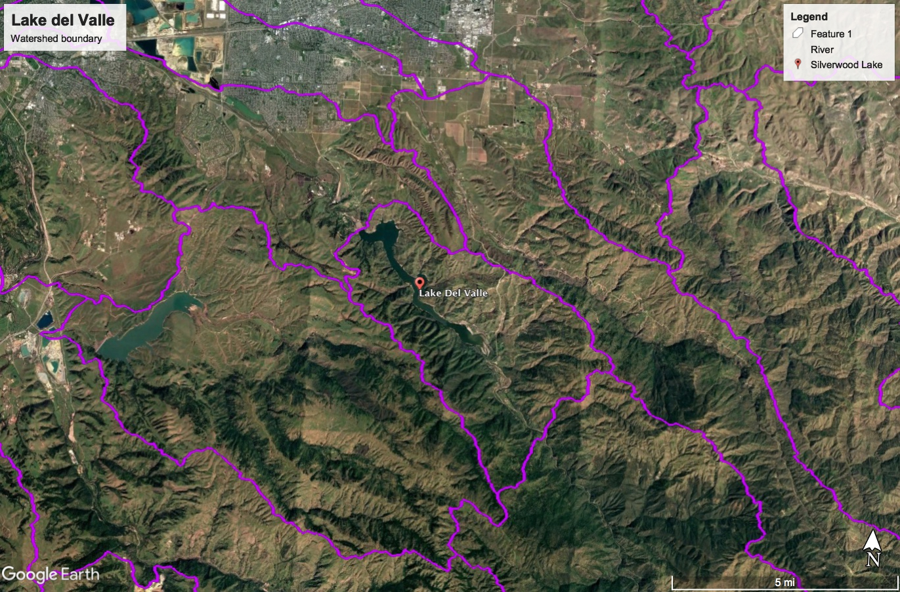

# Lake del Valle

> Located in Arroyo Del Valle, about four miles from the City of Livermore in Alameda County, Del Valle Dam and Lake Del Valle provide regulatory storage for the South Bay Aqueduct, flood control for Alameda Creek, conservation of storm runoff, recreation, and fish and wildlife enhancement. The facility was constructed from 1966 and 1968.

## Data Sources

USGS discharge data is collected at the following site:

NOAA Temperature and Precipitation data was collected from the station in Livermore, CA.

## Data Files

| Filename                                                 | Type                             | Source/Site no.                                                                                        | Start Date | End Date   |
| -------------------------------------------------------- | -------------------------------- | ------------------------------------------------------------------------------------------------------ | ---------- | ---------- |
| [noaa_USC00045933.csv](noaa_USC00045933.csv)             | Temperature/Precipitation        | [NOAA USC00045933](https://www.ncdc.noaa.gov/cdo-web/datasets/GHCND/stations/GHCND:USC00045933/detail) | 1948-07-01 | 2018-07-21 |
| [usgs_11176400.csv](usgs_11176400.csv)                   | Discharge                        | [USGS 11176400](https://waterdata.usgs.gov/nwis/inventory?agency_code=USGS&site_no=11176400)           | 1963-10-01 | 2018-07-25 |
| [cdec_DLV_monthly_69_18.csv](cdec_DLV_monthly_69_18.csv) | Reservoir Storage (af) - Monthly | [CDEC DLV](http://cdec.water.ca.gov/dynamicapp/staMeta?station_id=DLV)                                 | 1969-10-01 | 2018-07-01 |