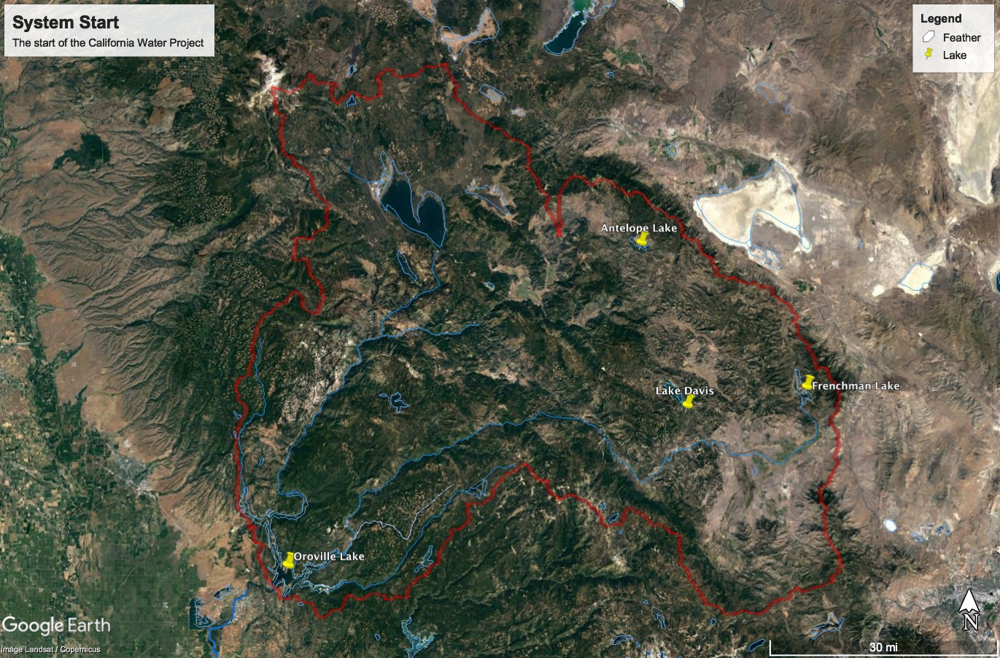

# Feather Watershed

The feather watershed is the watershed at the start of the State Water Project. It consists primarily of three lakes which feed into Lake Oroville.

## Data

Temperature/Precipitation data is from NOAA site USC00047195 in the middle of the watershed near Quincy, CA.

