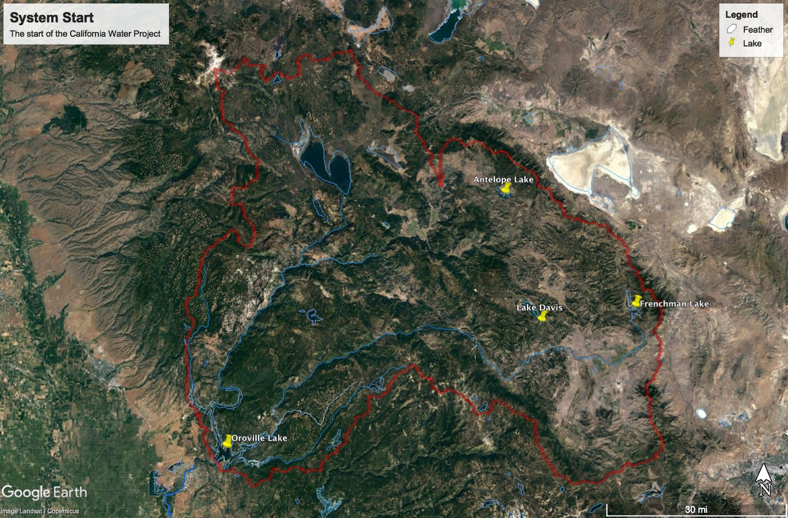
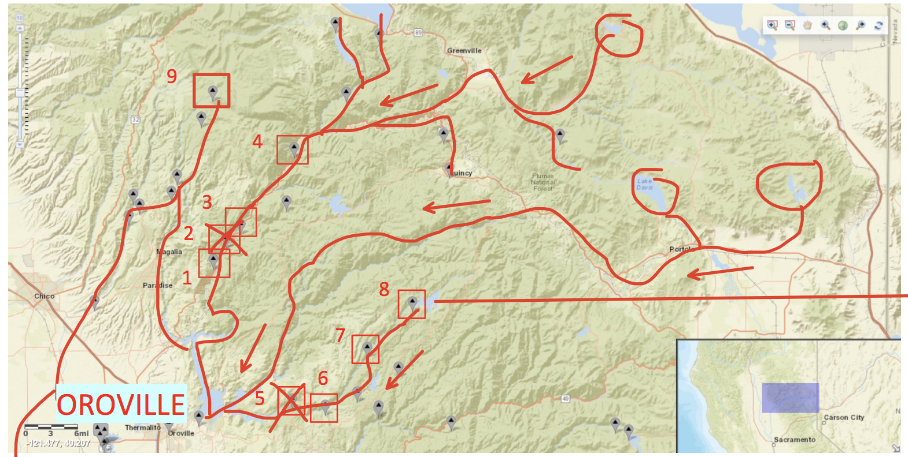

# Feather Watershed

- [Feather Watershed](#feather-watershed)
    - [Overview](#overview)
    - [Data Sources](#data-sources)
    - [Data Files](#data-files)
    - [Google Earth](#google-earth)

## Overview

The feather watershed is the watershed at the start of the State Water Project. It consists primarily of three lakes which feed into Lake Oroville.

## Data Sources

Streamgage data is from USGS sites 11404500, 11396200, and 11405200.

| #   | Site Info                                                                                                |
| --- | -------------------------------------------------------------------------------------------------------- |
| 1   | **Site Number:** [11404500](https://waterdata.usgs.gov/nwis/inventory?agency_code=USGS&site_no=11404500) |
| 6   | **Site Number:** [11396200](https://waterdata.usgs.gov/nwis/inventory?agency_code=USGS&site_no=11396200) |
| 9   | **Site Number:** [11405200](https://waterdata.usgs.gov/nwis/inventory?agency_code=USGS&site_no=11405200) |

Temperature/Precipitation data is from NOAA site USC00047195 in the middle of the watershed near Quincy, CA.

## Data Files

| Filename                                     | Type         | Source/Site no.                                                                                        | Start Date | End Date   |
| -------------------------------------------- | ------------ | ------------------------------------------------------------------------------------------------------ | ---------- | ---------- |
| [noaa_USC00047195.csv](noaa_USC00047195.csv) | Temp/Precip. | [NOAA USC00047195](https://www.ncdc.noaa.gov/cdo-web/datasets/GHCND/stations/GHCND:USC00047195/detail) | 1895-04-01 | 2018-07-23 |
| [usgs_11404500.csv](usgs_11404500.csv)       | Discharge    | [USGS 11404500](https://waterdata.usgs.gov/nwis/inventory?agency_code=USGS&site_no=11404500)           | 1911-04-01 | 2017-09-30 |
| [usgs_11396200.csv](usgs_11396200.csv)       | Discharge    | [USGS 11396200](https://waterdata.usgs.gov/nwis/inventory?agency_code=USGS&site_no=11396200)           | 1962-09-30 | 2017-09-30 |
| [usgs_11405200.csv](usgs_11405200.csv)       | Discharge    | [USGS 11405200](https://waterdata.usgs.gov/nwis/inventory?agency_code=USGS&site_no=11405200)           | 1986-08-27 | 2017-09-30 |

## Google Earth

- [FEA_watersheds.kml](http://hydra.ucdavis.edu/node/35) - Watershed boundary map
