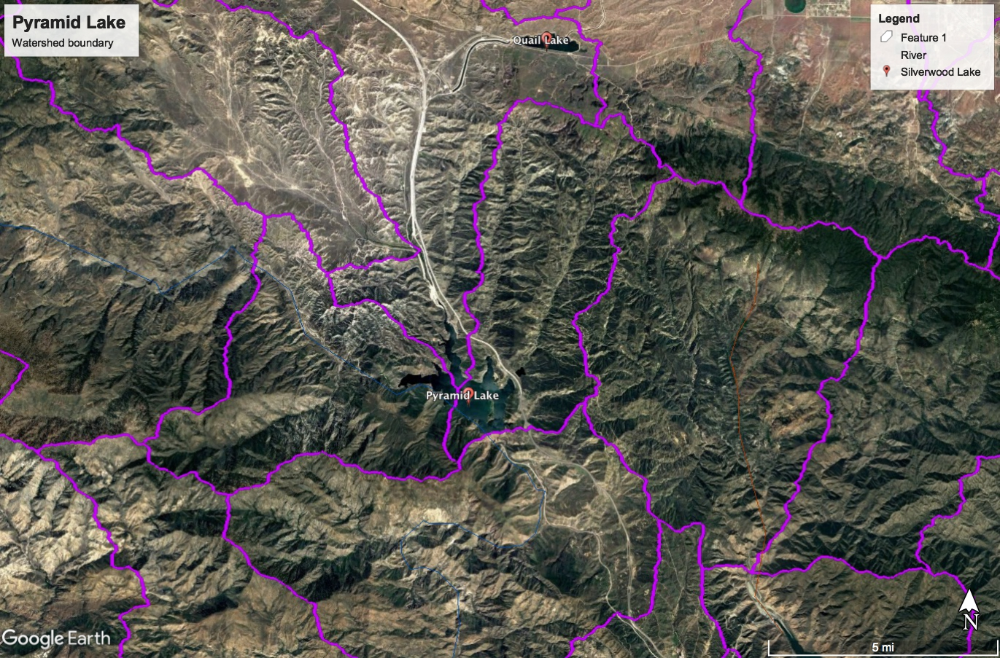

# Pyramid Lake

## Data Sources

USGS Discharge data was collected from the two stations below.

| #   | Site Info                                                                                                |
| --- | -------------------------------------------------------------------------------------------------------- |
| 1   | **Site Number:** [11109395](https://waterdata.usgs.gov/nwis/inventory?agency_code=USGS&site_no=11109395) |
| 2   | **Site Number:** [11109375](https://waterdata.usgs.gov/nwis/inventory?agency_code=USGS&site_no=11109375) |

The following station was used for Pyramid Lake which flows directly to it.

## Data Files

| Filename                                     | Type                             | Source/Site no.                                                                                        | Start Date | End Date   |
| -------------------------------------------- | -------------------------------- | ------------------------------------------------------------------------------------------------------ | ---------- | ---------- |
| [usgs_11109395.csv](usgs_11109395.csv)       | Discharge                        | [USGS 11109395](https://waterdata.usgs.gov/nwis/inventory?agency_code=USGS&site_no=11109395)           | 1976-10-01 | 2017-09-30 |
| [usgs_11109375.csv](usgs_11109375.csv)       | Discharge                        | [USGS 11109375](https://waterdata.usgs.gov/nwis/inventory?agency_code=USGS&site_no=11109375)           | 1976-10-01 | 2017-09-30 |
| [noaa_USW00023187.csv](noaa_USW00023187.csv) | Temperature/Precipitation        | [NOAA USW00023187](https://www.ncdc.noaa.gov/cdo-web/datasets/GHCND/stations/GHCND:USW00023187/detail) | 1948-01-01 | 2018-07-22 |
| [cdec_PYM_monthly.csv](cdec_PYM_monthly.csv) | Reservoir Storage (af) - Monthly | [CDEC PYM](http://cdec.water.ca.gov/dynamicapp/staMeta?station_id=PYM)                                 | 1974-10-01 | 2018-07-01 |