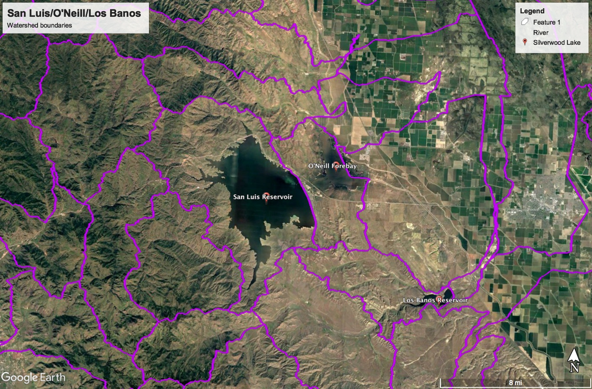

# San Luis Reservoir/O'Neill Forebay/Los Banos Reservoir

## Data Sources

Because San Luis is an artificial lake which water is pumped to, there is no upstream data. Nor are there any gauges for the O'Neill Forebay. The markers shown below in the reservoir are not generating real-time data.

The following NOAA gauge was selected for Temperature/Precipitation data.

## Data Files

| Filename                                     | Type                      | Source/Site no.                                                                                        | Start Date | End Date   |
| -------------------------------------------- | ------------------------- | ------------------------------------------------------------------------------------------------------ | ---------- | ---------- |
| [noaa_USC00045119.csv](noaa_USC00045119.csv) | Temperature/Precipitation | [NOAA USC00045119](https://www.ncdc.noaa.gov/cdo-web/datasets/GHCND/stations/GHCND:USC00045119/detail) | 1932-09-01 | 2018-05-31 |