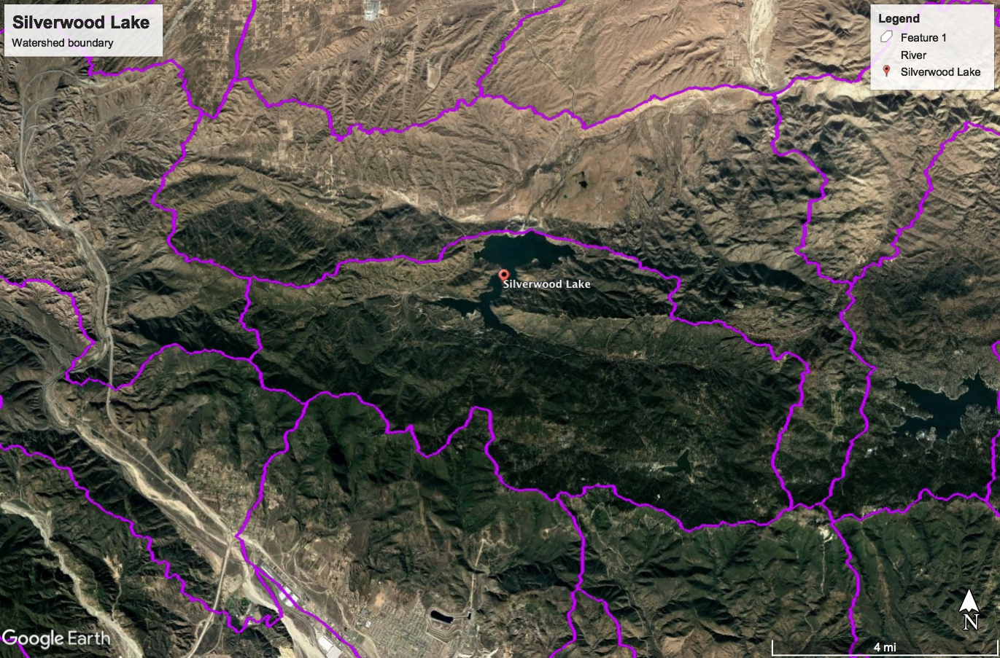

# Silverwood Lake

## Data Sources

Although data only goes back to 1995, it was still collected at the following two sites.

| #   | Site Info                                                                                                |
| --- | -------------------------------------------------------------------------------------------------------- |
| 1   | **Site Number:** [10260550](https://waterdata.usgs.gov/nwis/inventory?agency_code=USGS&site_no=10260550) |
| 2   | **Site Number:** [10260700](https://waterdata.usgs.gov/nwis/inventory?agency_code=USGS&site_no=10260700) |

NOAA temperature and precipitation data was not available for the region.

## Data Files

| Filename          | Type      | Source/Site no.                                                                              | Start Date | End Date   |
| ----------------- | --------- | -------------------------------------------------------------------------------------------- | ---------- | ---------- |
| usgs_10260550.csv | Discharge | [USGS 10260550](https://waterdata.usgs.gov/nwis/inventory?agency_code=USGS&site_no=10260550) | 1995-10-01 | 2017-09-30 |
| usgs_10260700.csv | Discharge | [USGS 10260700](https://waterdata.usgs.gov/nwis/inventory?agency_code=USGS&site_no=10260700) | 1995-10-01 | 2017-09-30 |