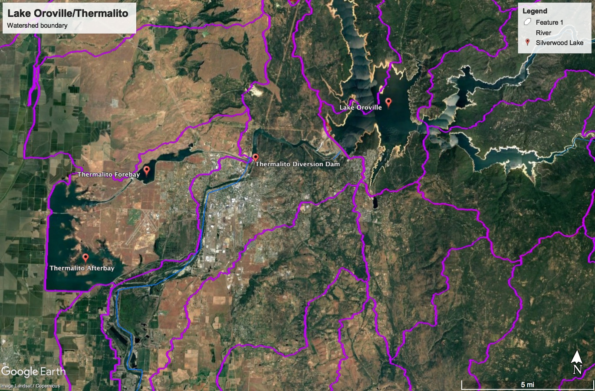
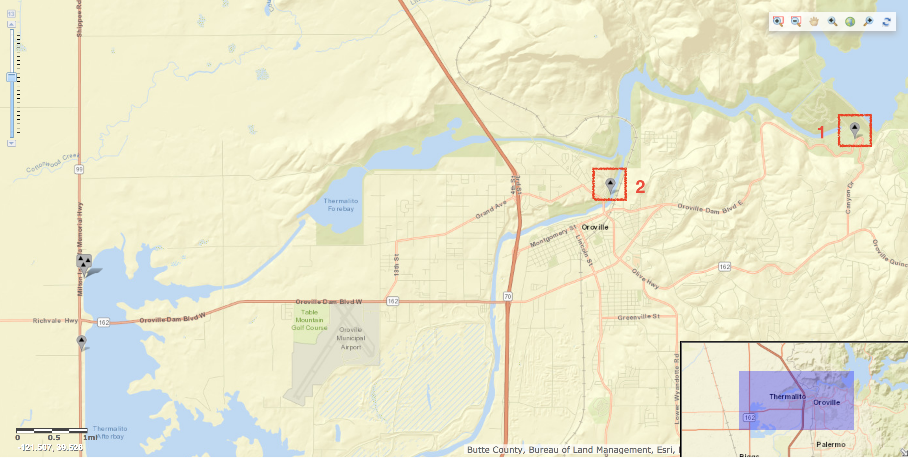

# Thermalito Afterbay

- [Thermalito Afterbay](#thermalito-afterbay)
    - [Data Sources](#data-sources)
    - [Data Files](#data-files)

The Thermalito Afterbay directly follows Lake Oroville in the State Water Project.

## Data Sources

Discharge data was collected for the following sites:

| #   | Site Info                                                                                                |
| --- | -------------------------------------------------------------------------------------------------------- |
| 1   | **Site Number:** [11406810](https://waterdata.usgs.gov/nwis/inventory?agency_code=USGS&site_no=11406810) |
| 2   | **Site Number:** [11407000](https://waterdata.usgs.gov/nwis/inventory?agency_code=USGS&site_no=11407000) |

## Data Files

| Filename                               | Type      | Source/Site no.                                                                              | Start Date | End Date   |
| -------------------------------------- | --------- | -------------------------------------------------------------------------------------------- | ---------- | ---------- |
| [usgs_11406810.csv](usgs_11406810.csv) | Discharge | [USGS 11406810](https://waterdata.usgs.gov/nwis/inventory?agency_code=USGS&site_no=11406810) | 1968-10-01 | 2017-09-30 |
| [usgs_11407000.csv](usgs_11407000.csv) | Discharge | [USGS 11407000](https://waterdata.usgs.gov/nwis/inventory?agency_code=USGS&site_no=11407000) | 1901-10-01 | 2017-09-30 |